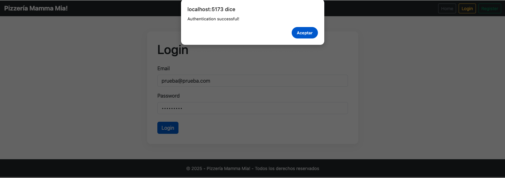

# Hito 2 - Pizzería Mamma Mia!  Auth (React + Vite)

El Proyecto validará "estados de los componentes y eventos" con formularios:
- `Login` (campos: email, password)
- `Register` (campos: email, password, confirm)

Validaciones mínimas:
- Todos los campos obligatorios
- Password >= 6 caracteres
- Password y confirmación iguales (en Register)
- Mensajes con `alert()` (éxito/error) como en la maqueta

## Cómo ejecutar
1. Abre una terminal en la carpeta del proyecto.
2. Ejecuta:
   npm install
   npm run dev
3. Abre la URL que te muestra Vite (por defecto http://localhost:5173).

## Alternar entre Login y Register
En `src/App.jsx` esta comentado `Home` y el form que no se quiera probar.
Visible Login. Descomentar `RegisterPage` y comentar `LoginPage`
para probar el registro.

Se observa:

-----
Marcela Morales Peralta
